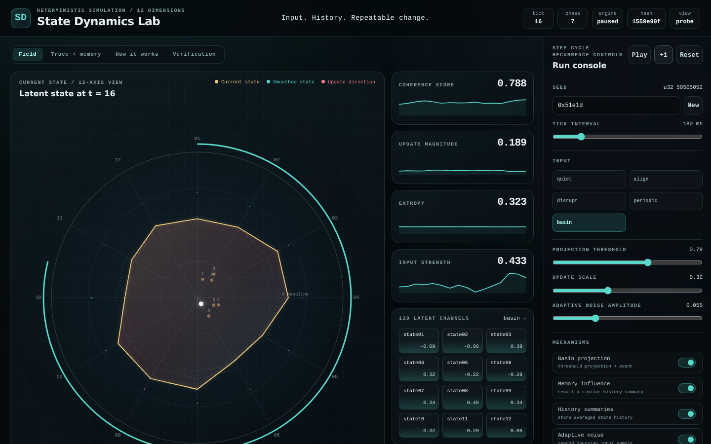

# State Dynamics Engine

A deterministic simulator for a bounded 12-number state. You can step one
update, turn a mechanism off, and export a trace that replays to the same
numbers.

**Try the demo:** [State Dynamics Lab](https://donaldtuttle.github.io/state-dynamics-engine/simulator/)

The lab is the interface for the reference engine. The other hosted views are
listed after the quick start. This repository does not send the simulation to
a remote API.



State Dynamics Lab, seed `0x51e1d`, input `basin`, tick 16, paused. The gold
polygon and the twelve readouts are the current state. The teal trace is the
smoothed state. The diagnostic hash is `1559e90f`. No basin projection had
fired. This is one real run, not a comparison score.

## What the 12 numbers are

They are abstract simulation coordinates. They do not have physical units, and
they are not assigned psychological meanings. The six fixed targets used by
basin projection are only named Basin 1 through Basin 6.

A new run draws each coordinate from the seed with
`(random * 2 - 1) * 0.6`, then applies the bounds below. The starting
coherence is 0.42 and the starting input strength is 0. The same seed and
configuration produce the same initial vector.

Every update clamps each coordinate to [-2, 2], then limits the whole vector
to a Euclidean norm of 2.

One step does the following, in this order. The formulas are in
[the implementation guide](docs/IMPLEMENTATION.md).

1. Smooth the previous state toward the current state.
2. If memory is on, recall the most similar stored history summary.
3. Build this tick's input from the selected stimulus, plus seeded noise if
   noise is on, plus a fraction of the recalled summary if memory is on.
4. Take a bounded step from that input toward the current state. Coherence
   changes the size of the step.
5. Combine the step with the smoothed state and apply the bounds again.
6. If basin projection is on, and the coherence, dwell, hysteresis, and hold
   rules allow it, blend the state most of the way toward the nearest basin
   vector.

The coherence score is a weighted mix of alignment, input size, update size,
and the previous score. It is a local control value for this software. It is
not a measure of intelligence or awareness.

What you can investigate today is how this trajectory changes when you alter
the seed, the input mode, or one mechanism, and whether an export replays.
What you cannot conclude from the included tests is that the model is useful
on an external task. That comparison has not been run. A proposal is in
[docs/BASELINE_PROPOSAL.md](docs/BASELINE_PROPOSAL.md).

## Start here

| Piece | What it is |
| --- | --- |
| [State Dynamics Engine](src/engine.ts) | The reference simulation library |
| [State Dynamics Lab](apps/simulator/README.md) | The interactive interface for that library |

Use the lab, or the `run` example below. Memory Weather is a separate
experiment with different equations. It is not required to try the reference
engine.

### Run it locally

Requirements: Node.js 22.12 or later and npm.

```bash
npm ci
npm run install:apps
npm --prefix apps/simulator run dev
```

Open the local address printed by Vite.

### Quick experiment

This turns off adaptive noise and repeats the same seed and input.

In the lab:

1. Open the demo. Leave the seed at `0x51e1d`. Choose **basin**. Press **+1**
   sixteen times. The screenshot above is this run: hash `1559e90f`.
2. Press **Reset**. Turn **Adaptive noise** off. Press **+1** sixteen times
   again.
3. Compare the hash and the twelve state readouts with the first run.

The same comparison from the library:

```bash
node --experimental-strip-types -e "import { run, hashState } from './src/engine.ts'; const seed = '0x51e1d'; const base = { stimulus: 'basin' }; const on = run(16, seed, { ...base, mechanisms: { noise: true } }); const off = run(16, seed, { ...base, mechanisms: { noise: false } }); const fmt = (r) => r.currentState.latent.map((x) => x.toFixed(3)).join(' '); console.log('noise on ', hashState(on.currentState), fmt(on)); console.log('noise off', hashState(off.currentState), fmt(off));"
```

A check of that command on 2026-10-04 printed:

```text
noise on  1559e90f -0.088 -0.005 0.381 0.323 -0.218 -0.279 0.341 0.401 0.338 -0.316 -0.200 0.053
noise off 893ac1c4 -0.754 0.491 0.315 0.961 0.125 -0.051 0.061 0.319 0.060 -0.058 0.046 0.010
```

`{ noise: false }` disables only noise. Projection, memory, and summaries stay
at their defaults.

Noise uses its own random stream, reseeded from the seed and the tick, separate
from the stimulus stream. Turning noise off skips that tick's noise draws. It
does not move later ticks onto different noise seeds, and it does not change
the stimulus samples. The two runs differ because one input contains noise and
the other does not. The same seed does not by itself match a comparison if the
input mode, schedule, or another setting also changes.

This establishes that the noise switch changes this implementation's
trajectory. It does not establish that noise helps or hurts any task. The same
limit applies to turning off projection, memory, or summaries. Those three
switches do not draw the noise stream. Memory can still add a recalled vector
to the input, which changes the state without changing the random sequence.

Scheduled pulses and validated configuration changes use `createSession()` in
`apps/simulator/src/session.ts`. The export format is described in
[docs/TRACE_FORMAT.md](docs/TRACE_FORMAT.md).

## Other hosted views

These are optional. Memory Weather is not the reference engine, and its
trajectory is not claimed to match.

| View | URL |
| --- | --- |
| Lab probe | https://donaldtuttle.github.io/state-dynamics-engine/simulator/probe.html |
| Site index | https://donaldtuttle.github.io/state-dynamics-engine/ |
| [Memory Weather](apps/memory-weather/README.md) | https://donaldtuttle.github.io/state-dynamics-engine/memory-weather/ |
| [Memory Weather Lab](apps/memory-weather-lab/README.md) | https://donaldtuttle.github.io/state-dynamics-engine/memory-weather-lab/ |

The standalone file
[apps/memory-weather/dist/memory-weather.html](apps/memory-weather/dist/memory-weather.html)
also opens from disk.

## Familiar models, briefly

The update is a bounded nonlinear recurrence with a smoother, optional noise,
optional recalled history, and an optional blend toward fixed vectors. That
is similar in parts to a leaky integrator, and only loosely similar to an
attractor network. It is not an echo-state network and not a Hopfield network.
The distinctions and a not-yet-run comparison are in
[docs/BASELINE_PROPOSAL.md](docs/BASELINE_PROPOSAL.md).

## Verify and build

```bash
npm run verify
npm run build:site
python3 -m http.server 8000 --directory _site
```

Open `http://localhost:8000`. See [verification](docs/VERIFICATION.md) for the
migration checks. Those checks reproduce the historical numbers. They are not
a task benchmark.

## Origins and license

This project is an independent successor to the QOFT/QOSMOS reference
implementation at commit `1ab947e0cb75afaf0e7ecad11a8aa5e02b510ebc`.
[ORIGINS.md](ORIGINS.md) records attribution. The original research contracts
remain in that repository. Public names and export schemas have changed.
[Migration notes](docs/MIGRATION.md) explain the v1-session adapter and its
limits.

Version 0.1.0 is an experimental software release. Mozilla Public License 2.0.
Copyright 2026 Donald Tuttle. See [LICENSE](LICENSE) and [NOTICE](NOTICE).
